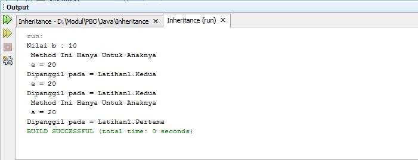
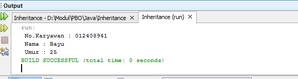
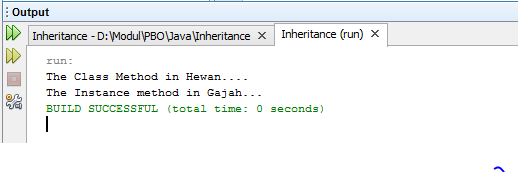
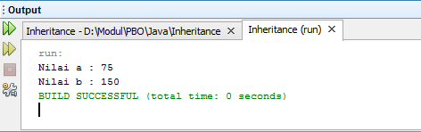

# Inheritance

## Latihan1

Di Program ini terdapat 3 class dimana class 2 menginherit class 
pertama dan di class ke 3 akan memanggil perintah dari class 1 dan 2

## Latihan2

Di Program ini terdapat 3 class dimana class 2 menginherit class 
pertama dan di class ke 3 akan memanggil perintah dari class 1 dan menambah value dari yang kita isi di class ke 3 dan ditampilkan

## Latihan3

Di Program ini terdapat 3 class dimana class 2 menginherit class 
pertama dan di class ke 3 akan memanggil perintah dari class 1 dan 2 dan akan ditampilkan 

## Latihan 4

Di Program ini terdapat 3 class dimana class 2 menginherit class 
pertama dan memiliki constructor yang sama dan akan di tampilkan di class 3

## Latihan 5

Di Program ini terdapat 2 class dimana class 2 menginherit class 
pertama dan di class pertama kita membuat constructor dan variable dan di class kedua kita mengisi value dan di tampilkan

## Latihan 6

